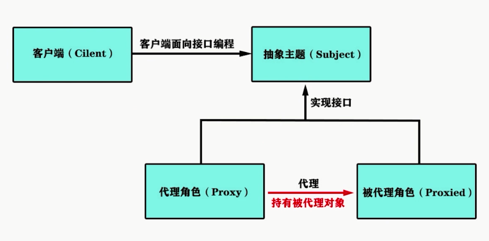

## AOP 基础

### 容器是 OOP 的高级工具

以低耦合低侵入的方式打通从上到下的开发通道

- 按部就班填充代码逻辑实现业务功能，每层逻辑都可无缝切换
- OOP 将业务程序分解成各个层次的对象，通过对象联动完成业务
- 无法很好地处理分散在各业务里的通用系统需求

### 系统需求

- 添加日志信息：为每个方法添加统计时间
- 添加系统权限校验：针对某些方法进行限制
- OOP 下必须得为每个方法都添加通用的逻辑工作，增加维护成本

### 关注点分离（Concern Separation）

不同的问题交给不同的部分去解决，每部分专注解决自己的问题

- Aspect Oriented Programming 就是其中一种关注点分离的技术
- 通用化功能的代码实现即切面 Aspect
- Aspect 之于 AOP，就相当于 Class 之于 OOP，Bean 之于 Spring(IOC)

### 代理模式

### 寻求改进

溯源 ClassLoader

- 通过带有包名的类来获取对应 class 文件的二进制字节流
- 根据读取的字节流，将代表的静态存储结构转化为运行时数据结构
- 生成一个代表该类的 Class 对象，作为方法区该类的数据访问入口

### 改进的切入点

根据一定规则去改动或者生成新的字节流，将切面逻辑织入其中

- 行之有效的方案就是取代被代理类的动态代理机制
- 根据接口或者目标类，计算出代理类的字节码并加载到 JVM 中去

### JDK 动态代理

- 程序运行时动态生成类的字节码，并加载到 JVM 中
- 要求【被代理的类】必须实现接口
- 并不要求【代理对象】去实现接口，所以可以复用代理对象的逻辑

### CGLIB 动态代理

代码生成库：Code Generation Library

- 不要求被代理类实现接口
- 内部主要封装了 ASM Java 字节码操控框架
- 动态生成子类以覆盖非 final 的方法，绑定钩子回调自定义拦截器

### JDK 动态代理和 CGLIB

实现机制

- JDK 动态代理：基于反射机制实现，要求业务类必须实现接口
- CGLIB：基于 ASM 机制实现，生成业务类的子类作为代理类

JDK 动态代理的优势

- JDK 原生，在 JVM 里运行较为可靠
- 平滑支持 JDK 版本的升级

CGLIB 的优势

- 被代理对象无需实现接口，能实现代理类的无侵入

---

## AOP 1.0

### 实现自研框架的 AOP 1.0

使用 CGLIB 来实现：不需要业务类实现接口，相对灵活

- 解决标记的问题，定义横切逻辑的骨架
- 定义 Aspect 横切逻辑以及被代理方法的执行顺序
- 将横切逻辑织入到被代理的对象以生成动态代理对象

### 解决横切逻辑的标记问题以及定义 Aspect 骨架

- 定义与横切逻辑相关的注解
- 定义供外部使用的横切逻辑骨架

### 实现 Aspect 横切逻辑以及被代理方法的定序执行

- 创建 `MethodInterceptor` 的实现类
- 定义必要的成员变量——被代理的类以及 Aspect 列表
- 按照 `Order` 对 Aspect 进行排序
- 实现对横切逻辑以及被代理对象方法的定序执行

### 自研框架的 AOP 1.0 待改进的地方

- Aspect 只支持对被某个标签标记的类进行横切逻辑的织入
- 需要披上 AspectJ 的外衣

## AOP 2.0

### 折中方案改进框架里的AOP

使用最小的改造成本，换取尽可能大的收益——理清核心诉求

- 让 Pointcut 更加灵活
- 只需引入 AspectJ 的切面表达式和相关的定位解析机制

---

## 总结

自研框架 AOP 的实现
- AOP 概念
    - SpringAOP 的用法
    - AOP 的子民
    - Aspect
    - Advice 及其种类
    - JoinPoint
    - Pointcut
    - 织入和织入器
- SpringAOP 的实现
    - 代理模式
    - JDK 动态代理及其用法
    - CGLIB 及其用法
    - 各自的使用场景
- 自研框架 AOP 1.0 的实现
    - 基于 CGLIB
    - 注解标签和 Aspect 骨架的定义
    - Aspect 的排序以及 Advice 的定序
    - 横切逻辑的织入
    - AOP 1.0 的短板分析
- 披上AspectJ的外衣
    - AspectJ 的两件利器
    - SpringAOP 如何复用 AspectJ 的功能
    - 重构自研框架 AOP，实现 2.0