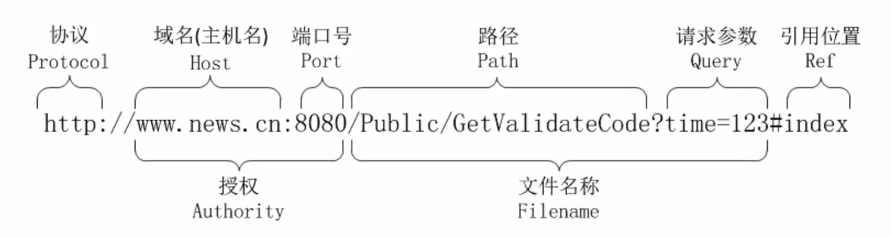

## Spring IOC

造轮子

> 内部准备：Log4j2 https://segmentfault.com/a/1190000039751787

### IoC 外围阵地争夺战

- 工厂模式
    - 简单工厂模式
    - 工厂方法模式
    - 抽象工厂模式
- 反射机制
    - Class对象
        - 构造方法
        - 成员变量
        - 成员方法
- 注解
    - 定义
    - 功能
    - 分类
        - 元注解
            - Retention
            - Target
        - 自定义注解
            - 创建和使用
            - 获取属性
- 控制反转
    - 依赖注入DI
    - IoC容器
    

---

## 框架具备的最基本功能

- 解析配置 - 注解方式
- 定位与注册对象
- 注入对象
- 提供通用的工具类

### IoC容器的实现

#### 1. 需要实现的点

1. 创建注解
2. 提取标记对象
3. 实现容器（Spring里并没有立刻实现，而是存储类的Class对象以及注解等，在首次使用对象再创建实例等等）
4. 依赖注入

#### 2. 提取标记对象

实现思路

1. 指定范围，获取范围内的所有类
2. 遍历所有类，获取被注解标记的类并加载进容器里
   
[extractPackageClass](./src/main/java/cn/yuyake/util/ClassUtil.java)里需要完成的事情

- 获取到类的加载器 `java.lang.ClassLoader`
- 通过类加载器获取到加载的资源信息 ``
- 依据不同的资源类型，采用不同的方法获取资源的集合

> - 获取项目发布的实际路径：`cn.yuyake`
> - 为何不用绝对路径：不够友好；war/jar找不到路径 --> 通过项目的类加载器来获取
> - 类加载器ClassLoader：根据一个指定的类的名称，找到或者生成其对应的字节码；加载Java应用所需的资源
> - `ClassLoader.getResource()` --> 统一资源定位符URL：某个资源的唯一地址
>   - `URL.getProtocol()` 获取协议类型
>   - `URL.getPath()` 获取绝对路径

[单例模式](./src/test/java/cn/yuyake/singletion/SingletonDemo.java) Singleton Pattern：确保一个类只有一个实例，并对外提供统一访问方式

- 饿汉模式：类被加载的时候就立即初始化并创建唯一实例
- 懒汉模式：在被客户端首次调用的时候才创建唯一实例
- 加入双重检查锁机制的懒汉模式能确保线程安全
- 装备了枚举的饿汉模式能抵御反射与序列化的进攻，满足容器需求

#### 3. [实现容器](./src/main/java/cn/yuyake/core/BeanContainer.java)

1. 容器的组成
    - 保存Class对象及其实例的载体
    - 容器的加载
    - 容器的操作方式
2. 实现容器的加载
    - 配置的管理与获取
    - 获取指定范围内的Class对象
    - 依据配置提取Class对象，连同实例一并存入容器
3. 实现容器的操作方式（涉及容器的增删改查）
    - 增加、删除操作
    - 根据Class获取对应实例
    - 获取所有的Class和实例
    - 通过注解来获取被注解标注的Class
    - 通过超类获取对应的子类Class
    - 获取容器载体保存Class的数量

容器管理的Bean实例（Spring有多种作用域）

- singleton：单例模式（只有一个实现）
- prototype：原型模式（每次获取都新建实例）
- request：http请求每次产生新实例
- session：http session都产生新实例
- globalsession